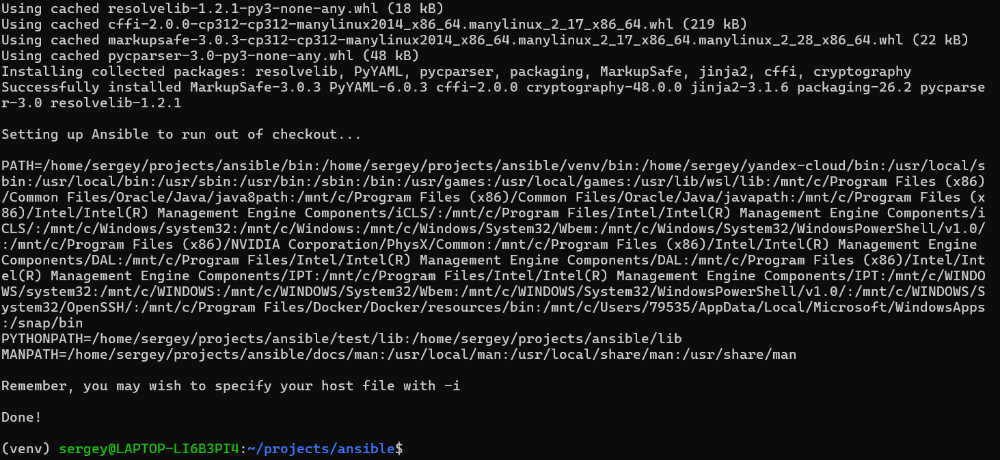
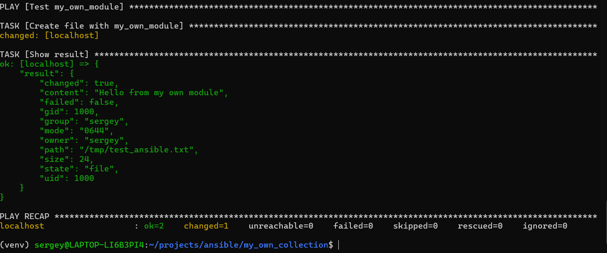
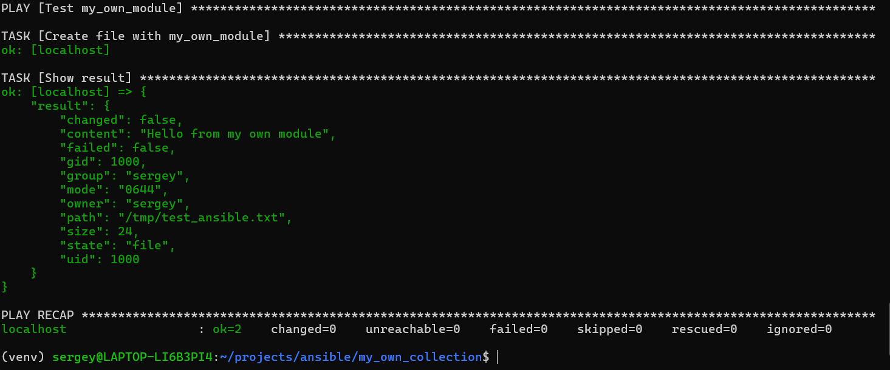
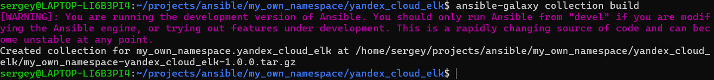
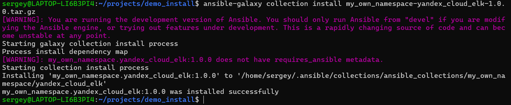
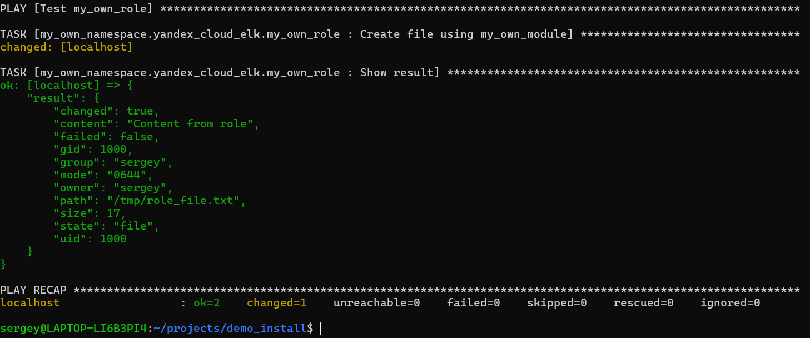
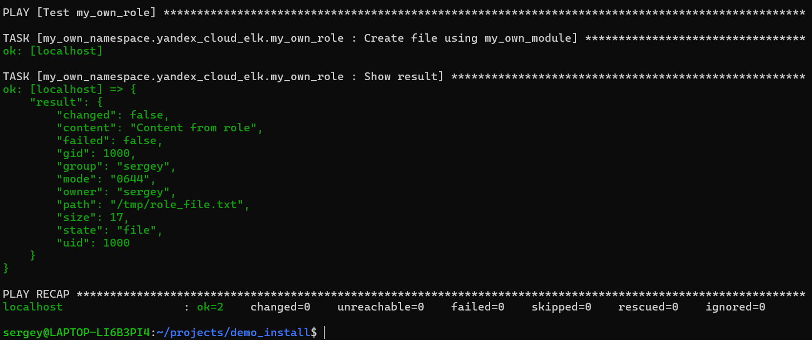
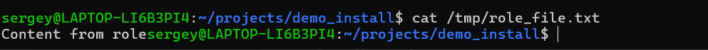

# Коллекция my_own_namespace.yandex_cloud_elk

Выполнил: **Овсянников Сергей**

## Скриншоты выполнения

### 1. Настройка окружения Ansible

### 2. Первый запуск модуля (changed=1)

### 3. Повторный запуск модуля (changed=0) – идемпотентность

### 4. Сборка коллекции

### 5. Установка коллекции из архива

### 6. Первый запуск плейбука с ролью (changed=1)

### 7. Повторный запуск плейбука (changed=0) – идемпотентность

### 8. Содержимое созданного файла

## Что сделано
- Создан модуль `my_own_module` (создаёт файл по пути `path` с содержимым `content`).
- Создана роль `my_own_role`, использующая этот модуль.
- Роль параметризована через `defaults` (`path`, `content`).
- Коллекция собрана (`ansible-galaxy collection build`).
- Установка из локального архива и запуск плейбука выполнены успешно.
- Идемпотентность подтверждена (повторный запуск – `changed=0`).

## Ссылка на репозиторий
[https://github.com/sergey-281296/my_own_collection](https://github.com/sergey-281296/my_own_collection)
